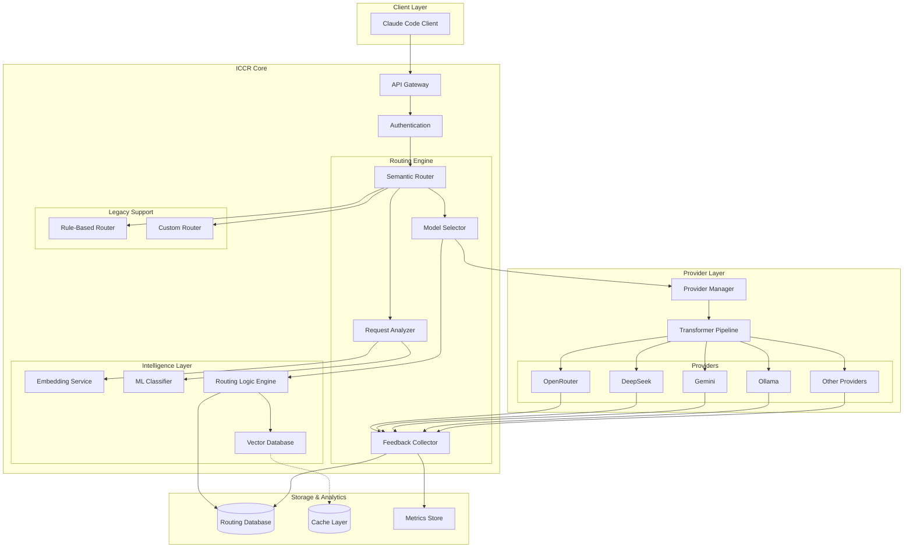
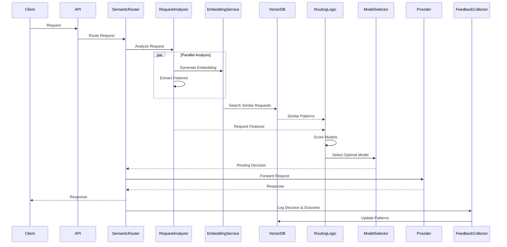

# Architecture Document: Intelligent Claude Code Router (ICCR)

## Executive Summary

This document outlines the architecture for an enhanced version of `claude-code-router` that incorporates **Intelligent/Semantic Routing** capabilities. The Intelligent Claude Code Router (ICCR) extends the current rule-based routing system with AI-powered semantic understanding to make smarter, context-aware routing decisions.

## 1. Overview

### 1.1 Current Architecture Limitations

The existing `claude-code-router` uses a **rule-based routing system** with the following characteristics:

- **Static routing rules**: Routes are determined by predefined categories (`default`, `background`, `think`, `longContext`, `webSearch`, `image`)
- **Token-based thresholds**: Long context routing is triggered purely by token count
- **Manual model switching**: Users must explicitly use `/model` commands to override routing
- **Custom router scripts**: Advanced routing requires writing JavaScript functions

**Limitations:**
- Cannot understand the semantic intent or complexity of requests
- No learning from past routing decisions
- Limited ability to optimize for cost, latency, or quality trade-offs
- No automatic adaptation to model performance characteristics

### 1.2 ICCR Vision

The Intelligent Claude Code Router introduces:

1. **Semantic Request Analysis**: Understanding the intent, complexity, and requirements of each request
2. **Dynamic Model Selection**: Choosing the optimal model based on multiple factors beyond simple rules
3. **Performance Feedback Loop**: Learning from outcomes to improve routing decisions
4. **Cost-Quality Optimization**: Balancing performance requirements with resource constraints
5. **Context-Aware Routing**: Considering conversation history and project context

## 2. System Architecture

### 2.1 High-Level Architecture



### 2.2 Component Descriptions

#### 2.2.1 Semantic Router

The core intelligence component that orchestrates the routing decision process.

**Responsibilities:**
- Receive and preprocess incoming requests
- Coordinate between different routing strategies
- Fallback to rule-based routing when semantic routing has low confidence
- Maintain routing decision history

**Key Features:**
- Multi-strategy routing (semantic + rule-based hybrid)
- Confidence scoring for routing decisions
- A/B testing support for routing strategies
- Request deduplication and caching

#### 2.2.2 Request Analyzer

Analyzes incoming requests to extract semantic features and metadata.

**Analysis Dimensions:**
- **Intent Classification**: Code generation, debugging, explanation, refactoring, testing, etc.
- **Complexity Estimation**: Simple, moderate, complex, expert-level
- **Domain Detection**: Web dev, systems programming, data science, DevOps, etc.
- **Resource Requirements**: Token budget, latency sensitivity, quality requirements
- **Context Depth**: Conversation history length, file context size

**Implementation:**
```typescript
interface RequestAnalysis {
  intent: IntentType;
  complexity: ComplexityLevel;
  domain: string[];
  estimatedTokens: number;
  requiresReasoning: boolean;
  requiresToolUse: boolean;
  requiresWebSearch: boolean;
  requiresImageProcessing: boolean;
  latencySensitivity: 'low' | 'medium' | 'high';
  qualityRequirement: 'standard' | 'high' | 'critical';
  contextMetadata: {
    conversationDepth: number;
    fileCount: number;
    codebaseSize: number;
  };
}
```

#### 2.2.3 Embedding Service

Generates semantic embeddings for requests and maintains a similarity search capability.

**Features:**
- Request embedding generation using lightweight models (e.g., `text-embedding-3-small`)
- Caching of embeddings for similar requests
- Similarity search for finding similar past requests
- Support for multiple embedding models

**Use Cases:**
- Finding similar requests that were successfully routed
- Clustering requests by semantic similarity
- Detecting request patterns for optimization

#### 2.2.4 Vector Database

Stores embeddings and enables fast similarity search.

**Storage:**
- Request embeddings
- Successful routing patterns
- Model performance profiles
- User preference vectors

**Recommended Implementation:**
- **Option 1**: Lightweight embedded solution (e.g., `hnswlib`, `faiss`)
- **Option 2**: SQLite with vector extension (e.g., `sqlite-vss`)
- **Option 3**: External service (e.g., Qdrant, Milvus) for large-scale deployments

#### 2.2.5 ML Classifier

Machine learning models for routing decisions.

**Models:**
- **Intent Classifier**: Categorizes request intent
- **Complexity Estimator**: Predicts task complexity
- **Model Performance Predictor**: Estimates which model will perform best

**Training Data Sources:**
- Historical routing decisions and outcomes
- User feedback (explicit and implicit)
- Model performance metrics
- Cost and latency data

**Initial Implementation:**
- Start with simple heuristics and rule-based classification
- Gradually introduce ML models as data accumulates
- Support for online learning and model updates

#### 2.2.6 Routing Logic Engine

The decision-making core that selects the optimal model.

**Decision Factors:**
```typescript
interface RoutingDecision {
  selectedProvider: string;
  selectedModel: string;
  confidence: number;
  reasoning: string;
  alternatives: Array<{
    provider: string;
    model: string;
    score: number;
  }>;
  estimatedCost: number;
  estimatedLatency: number;
  expectedQuality: number;
}
```

**Routing Strategies:**

1. **Semantic Similarity Routing**
   - Find similar past requests
   - Use their successful routing decisions
   - Weight by recency and success rate

2. **Intent-Based Routing**
   - Map intents to optimal models
   - Consider model capabilities matrix

3. **Cost-Optimized Routing**
   - Select cheapest model that meets quality threshold
   - Implement tiered routing (try cheaper model first, escalate if needed)

4. **Performance-Optimized Routing**
   - Select fastest model for latency-sensitive requests
   - Consider model response time statistics

5. **Quality-Optimized Routing**
   - Select highest-performing model for critical tasks
   - Consider model benchmark scores and user ratings

6. **Hybrid Routing**
   - Combine multiple strategies with weighted scoring
   - Configurable weights per user/organization

#### 2.2.7 Feedback Collector

Collects performance data and user feedback to improve routing decisions.

**Metrics Collected:**
- Response quality (user ratings, error rates)
- Latency (time to first token, total response time)
- Cost (tokens used, API costs)
- Success rate (task completion, user satisfaction)
- Tool usage effectiveness
- Reasoning quality (for reasoning models)

**Feedback Types:**
- **Explicit**: User ratings, thumbs up/down
- **Implicit**: Retry requests, model switches, conversation abandonment
- **Automated**: Error detection, timeout tracking, cost overruns

## 3. Routing Decision Flow



## 4. Configuration Schema

### 4.1 Enhanced Configuration

```json
{
  "semanticRouting": {
    "enabled": true,
    "confidence_threshold": 0.7,
    "fallback_to_rules": true,
    "embedding_model": "text-embedding-3-small",
    "embedding_cache_ttl": 3600,
    "vector_db": {
      "type": "sqlite-vss",
      "path": "~/.claude-code-router/vectors.db",
      "similarity_threshold": 0.85
    },
    "ml_models": {
      "intent_classifier": {
        "enabled": true,
        "model_path": "~/.claude-code-router/models/intent_classifier.onnx"
      },
      "complexity_estimator": {
        "enabled": true,
        "model_path": "~/.claude-code-router/models/complexity_estimator.onnx"
      }
    },
    "routing_strategy": {
      "type": "hybrid",
      "weights": {
        "semantic_similarity": 0.3,
        "intent_based": 0.3,
        "cost_optimization": 0.2,
        "performance_optimization": 0.1,
        "quality_optimization": 0.1
      }
    },
    "optimization_goals": {
      "cost_weight": 0.3,
      "latency_weight": 0.3,
      "quality_weight": 0.4
    }
  },
  "modelCapabilities": {
    "deepseek,deepseek-chat": {
      "strengths": ["code_generation", "debugging", "refactoring"],
      "weaknesses": ["creative_writing", "image_analysis"],
      "cost_per_1m_tokens": 0.14,
      "avg_latency_ms": 1200,
      "quality_score": 0.85,
      "max_context": 64000,
      "supports_tools": true,
      "supports_reasoning": false
    },
    "deepseek,deepseek-reasoner": {
      "strengths": ["complex_reasoning", "planning", "architecture"],
      "weaknesses": ["simple_tasks", "speed"],
      "cost_per_1m_tokens": 0.55,
      "avg_latency_ms": 3500,
      "quality_score": 0.92,
      "max_context": 64000,
      "supports_tools": true,
      "supports_reasoning": true
    },
    "openrouter,google/gemini-2.5-pro-preview": {
      "strengths": ["long_context", "multimodal", "reasoning"],
      "weaknesses": ["cost"],
      "cost_per_1m_tokens": 1.25,
      "avg_latency_ms": 2000,
      "quality_score": 0.95,
      "max_context": 2000000,
      "supports_tools": true,
      "supports_reasoning": true
    },
    "ollama,qwen2.5-coder:latest": {
      "strengths": ["cost", "privacy", "speed"],
      "weaknesses": ["quality", "reasoning"],
      "cost_per_1m_tokens": 0.0,
      "avg_latency_ms": 800,
      "quality_score": 0.70,
      "max_context": 32000,
      "supports_tools": false,
      "supports_reasoning": false
    }
  },
  "intentRouting": {
    "code_generation": {
      "preferred_models": [
        "deepseek,deepseek-chat",
        "openrouter,anthropic/claude-sonnet-4"
      ],
      "min_quality_score": 0.80
    },
    "debugging": {
      "preferred_models": [
        "deepseek,deepseek-reasoner",
        "openrouter,anthropic/claude-3.7-sonnet:thinking"
      ],
      "min_quality_score": 0.85
    },
    "explanation": {
      "preferred_models": [
        "deepseek,deepseek-chat",
        "ollama,qwen2.5-coder:latest"
      ],
      "min_quality_score": 0.75
    },
    "architecture_design": {
      "preferred_models": [
        "deepseek,deepseek-reasoner",
        "openrouter,google/gemini-2.5-pro-preview"
      ],
      "min_quality_score": 0.90
    },
    "simple_refactoring": {
      "preferred_models": [
        "ollama,qwen2.5-coder:latest",
        "deepseek,deepseek-chat"
      ],
      "min_quality_score": 0.70,
      "cost_optimization": true
    }
  },
  "feedbackCollection": {
    "enabled": true,
    "collect_metrics": true,
    "collect_user_feedback": true,
    "retention_days": 90,
    "anonymize_data": true
  }
}
```

### 4.2 Backward Compatibility

All existing configuration options remain supported. Semantic routing is opt-in and can be disabled:

```json
{
  "semanticRouting": {
    "enabled": false
  }
}
```

When disabled, ICCR behaves identically to the current `claude-code-router`.

## 5. Data Models

### 5.1 Routing Decision Record

```typescript
interface RoutingRecord {
  id: string;
  timestamp: number;
  request: {
    hash: string;
    embedding: number[];
    analysis: RequestAnalysis;
    tokenCount: number;
    messageCount: number;
  };
  decision: RoutingDecision;
  outcome: {
    success: boolean;
    latency: number;
    tokensUsed: number;
    cost: number;
    userRating?: number;
    errorType?: string;
  };
  metadata: {
    userId?: string;
    sessionId: string;
    clientVersion: string;
  };
}
```

### 5.2 Model Performance Profile

```typescript
interface ModelPerformanceProfile {
  provider: string;
  model: string;
  statistics: {
    totalRequests: number;
    successRate: number;
    avgLatency: number;
    avgCost: number;
    avgQualityScore: number;
  };
  intentPerformance: Record<IntentType, {
    requests: number;
    successRate: number;
    avgQualityScore: number;
  }>;
  complexityPerformance: Record<ComplexityLevel, {
    requests: number;
    successRate: number;
    avgQualityScore: number;
  }>;
  lastUpdated: number;
}
```

## 6. Implementation Phases

### Phase 1: Foundation (Weeks 1-2)
- [ ] Design and implement Request Analyzer
- [ ] Add basic intent classification (rule-based)
- [ ] Add complexity estimation (heuristic-based)
- [ ] Implement Routing Database schema
- [ ] Add metrics collection infrastructure

### Phase 2: Semantic Capabilities (Weeks 3-4)
- [ ] Integrate embedding service
- [ ] Implement vector database (SQLite-VSS)
- [ ] Build semantic similarity search
- [ ] Implement embedding caching
- [ ] Add model capabilities configuration

### Phase 3: Intelligent Routing (Weeks 5-6)
- [ ] Implement Routing Logic Engine
- [ ] Build multi-strategy routing
- [ ] Add confidence scoring
- [ ] Implement fallback mechanisms
- [ ] Add A/B testing support

### Phase 4: Feedback & Learning (Weeks 7-8)
- [ ] Implement Feedback Collector
- [ ] Build performance tracking
- [ ] Add user feedback mechanisms
- [ ] Implement routing optimization based on feedback
- [ ] Build analytics dashboard

### Phase 5: ML Integration (Weeks 9-10)
- [ ] Train initial ML models on collected data
- [ ] Integrate ML Classifier
- [ ] Implement online learning pipeline
- [ ] Add model performance prediction
- [ ] Build automated model retraining

### Phase 6: Polish & Optimization (Weeks 11-12)
- [ ] Performance optimization
- [ ] Add comprehensive testing
- [ ] Documentation
- [ ] Migration tools for existing users
- [ ] Beta testing and feedback incorporation

## 7. API Extensions

### 7.1 Routing Insights API

```typescript
// Get routing decision explanation
GET /api/routing/explain/:requestId
Response: {
  decision: RoutingDecision,
  factors: {
    semantic_similarity: { score: number, similar_requests: string[] },
    intent_match: { score: number, detected_intent: string },
    cost_optimization: { score: number, estimated_savings: number },
    performance: { score: number, estimated_latency: number },
    quality: { score: number, expected_quality: number }
  }
}

// Get model recommendations for a hypothetical request
POST /api/routing/recommend
Request: { request_text: string, preferences: object }
Response: {
  recommendations: Array<{
    provider: string,
    model: string,
    score: number,
    reasoning: string,
    estimated_cost: number,
    estimated_latency: number
  }>
}

// Submit feedback for a routing decision
POST /api/routing/feedback/:requestId
Request: { rating: number, comment?: string }
Response: { success: boolean }
```

### 7.2 Analytics API

```typescript
// Get routing statistics
GET /api/analytics/routing-stats
Response: {
  total_requests: number,
  routing_accuracy: number,
  avg_cost_per_request: number,
  avg_latency: number,
  model_distribution: Record<string, number>,
  intent_distribution: Record<string, number>
}

// Get model performance comparison
GET /api/analytics/model-performance
Response: Array<ModelPerformanceProfile>
```

## 8. User Experience Enhancements

### 8.1 CLI Enhancements

```bash
# View routing decision for last request
ccr routing explain

# Get model recommendations for a task
ccr routing recommend "Debug this authentication issue"

# View routing statistics
ccr analytics stats

# Configure semantic routing
ccr config semantic --enable
ccr config semantic --strategy hybrid
ccr config semantic --optimize-for cost
```

### 8.2 UI Enhancements

- **Routing Dashboard**: Visualize routing decisions and patterns
- **Model Performance Charts**: Compare model performance across dimensions
- **Cost Analytics**: Track spending by model and intent
- **Routing Insights**: Explain why specific routing decisions were made
- **Feedback Interface**: Easy rating and feedback submission

## 9. Privacy & Security Considerations

### 9.1 Data Privacy

- **Request Anonymization**: Hash or anonymize sensitive request content
- **Embedding Privacy**: Embeddings don't expose original request text
- **Local Storage**: All routing data stored locally by default
- **Opt-out**: Users can disable all data collection
- **Data Retention**: Configurable retention policies

### 9.2 Security

- **API Key Protection**: Embeddings generated locally, no API keys sent to external services
- **Secure Storage**: Encrypted storage for sensitive routing data
- **Access Control**: Authentication for analytics and feedback APIs
- **Audit Logging**: Track all routing decisions and configuration changes

## 10. Performance Considerations

### 10.1 Latency Optimization

- **Embedding Caching**: Cache embeddings for similar requests
- **Async Processing**: Non-blocking routing decision pipeline
- **Lazy Loading**: Load ML models on-demand
- **Request Batching**: Batch embedding generation for efficiency

**Target Latency Budget:**
- Request analysis: < 50ms
- Embedding generation: < 100ms (cached: < 5ms)
- Similarity search: < 20ms
- Routing decision: < 30ms
- **Total overhead: < 200ms**

### 10.2 Resource Usage

- **Memory**: Vector DB and embeddings cache < 500MB
- **Storage**: Routing database < 1GB for 100K requests
- **CPU**: Minimal overhead with efficient embedding models

## 11. Testing Strategy

### 11.1 Unit Tests
- Request analyzer accuracy
- Embedding generation consistency
- Routing logic correctness
- Feedback collection reliability

### 11.2 Integration Tests
- End-to-end routing flow
- Provider integration
- Database operations
- API endpoints

### 11.3 Performance Tests
- Latency benchmarks
- Throughput testing
- Memory usage profiling
- Concurrent request handling

### 11.4 A/B Testing
- Compare semantic routing vs rule-based routing
- Measure impact on cost, latency, and quality
- Gradual rollout with feature flags

## 12. Migration Path

### 12.1 For Existing Users

1. **Automatic Migration**: Existing configurations work without changes
2. **Opt-in Semantic Routing**: Enable via config or UI
3. **Gradual Adoption**: Start with low confidence threshold, increase over time
4. **Fallback Safety**: Always fall back to rule-based routing if semantic routing fails

### 12.2 Configuration Migration

```bash
# Migrate existing config to ICCR
ccr migrate --enable-semantic

# Test semantic routing without enabling
ccr routing test --dry-run

# Enable semantic routing with conservative settings
ccr config semantic --enable --confidence-threshold 0.8 --fallback true
```

## 13. Future Enhancements

### 13.1 Advanced Features

- **Multi-model Routing**: Route different parts of a request to different models
- **Speculative Execution**: Try multiple models in parallel, use fastest/best response
- **Adaptive Learning**: Automatically adjust routing strategies based on user patterns
- **Collaborative Filtering**: Learn from routing decisions across users (opt-in)
- **Cost Budgeting**: Enforce spending limits with automatic model downgrading
- **Quality Guarantees**: Retry with better model if quality threshold not met

### 13.2 Integration Opportunities

- **IDE Plugins**: Provide routing insights directly in IDEs
- **Monitoring Integration**: Export metrics to Prometheus, Grafana, etc.
- **LLM Observability**: Integration with LangSmith, Helicone, etc.
- **Team Analytics**: Shared routing insights for teams

## 14. Success Metrics

### 14.1 Key Performance Indicators

- **Routing Accuracy**: % of requests routed to optimal model (target: > 85%)
- **Cost Reduction**: Average cost savings vs always using premium models (target: > 30%)
- **Quality Maintenance**: User satisfaction scores (target: > 90%)
- **Latency Overhead**: Additional latency from semantic routing (target: < 200ms)
- **Adoption Rate**: % of users enabling semantic routing (target: > 50% within 6 months)

### 14.2 User Feedback Metrics

- User ratings of routing decisions
- Frequency of manual model overrides
- Feature usage statistics
- Support ticket reduction

## 15. Conclusion

The Intelligent Claude Code Router (ICCR) represents a significant evolution of the claude-code-router project, introducing AI-powered semantic routing while maintaining backward compatibility and the simplicity that makes the current version successful.

By combining semantic understanding, machine learning, and performance feedback, ICCR will:

1. **Reduce Costs**: Route simple tasks to cheaper models automatically
2. **Improve Quality**: Select the best model for each specific task
3. **Enhance User Experience**: Eliminate manual model selection overhead
4. **Enable Learning**: Continuously improve routing decisions based on outcomes
5. **Maintain Flexibility**: Support both automated and manual routing strategies

The phased implementation approach ensures that each component can be developed, tested, and validated independently, reducing risk and enabling iterative improvement based on real-world usage data.

---

**Document Version**: 1.0  
**Last Updated**: 2025-11-24  
**Status**: Draft for Review
