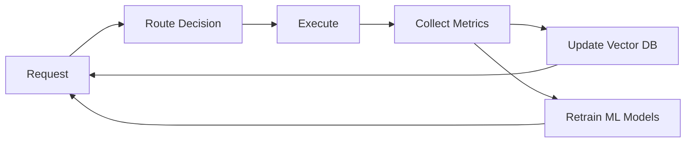
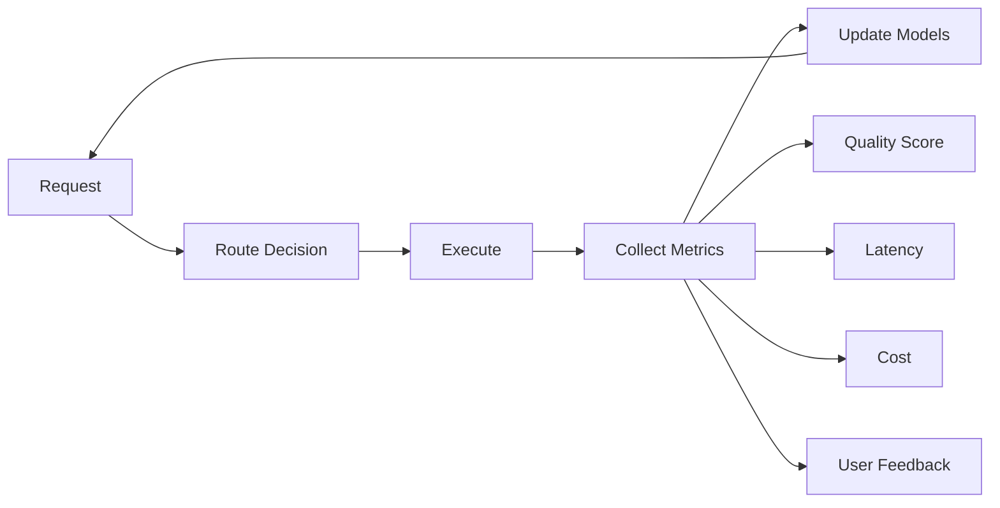

# Comparison: Current CCR vs. Proposed ICCR

> **Source Documents:**
> - Current CCR: [`docs/current_ccr_features_summary.md`](./current_ccr_features_summary.md)
> - Proposed ICCR: [`docs/arch_iccr.md`](./arch_iccr.md)

This document provides a detailed comparison between the **current Claude Code Router (CCR)** implementation and the **proposed Intelligent Claude Code Router (ICCR)** architecture.

---

## Executive Summary

| Aspect | Current CCR | Proposed ICCR |
|--------|-------------|---------------|
| **Routing Approach** | Rule-based keyword matching | AI-powered semantic understanding |
| **Intelligence** | Static configuration | ML classifiers + vector similarity |
| **Optimization** | Manual user decisions | Automatic multi-factor optimization |
| **Learning** | None | Feedback loops + performance tracking |
| **Complexity** | Simple (~50MB) | Advanced (~200MB with ML models) |
| **Configuration** | JSON with routes + keywords | Enhanced JSON + model capabilities |
| **Latency Overhead** | <1ms | ~80ms (first request), ~30ms (cached) |

---

## 1. Core Architecture Comparison

### Current CCR Architecture

**Components:**
- API Gateway (proxy layer)
- Rule-Based Router (keyword matching)
- Provider Manager (multi-provider support)
- Transformer Pipeline (request/response adaptation)
- Custom Router (optional JavaScript functions)

**Routing Flow:**
```
Request → Check /model lock → Match keywords → Use default → Forward to provider
```

**Characteristics:**
- ✅ Simple and predictable
- ✅ Low latency (<1ms routing overhead)
- ✅ Easy to understand and debug
- ❌ No semantic understanding
- ❌ No learning or optimization

### Proposed ICCR Architecture

**Additional Components:**
- **Semantic Router**: Orchestrates intelligent routing
- **Request Analyzer**: Extracts semantic features
- **Embedding Service**: Generates request embeddings
- **Vector Database**: Stores routing patterns and similarities
- **ML Classifier**: Intent classification + complexity estimation
- **Routing Logic Engine**: Multi-factor decision making
- **Feedback Collector**: Performance tracking and learning

**Routing Flow:**
```
Request → Semantic Analysis → Generate Embedding → Vector Similarity Search
       → ML Classification → Multi-Factor Scoring → Select Optimal Model
       → Forward to Provider → Collect Feedback → Update Models
```

**Characteristics:**
- ✅ Semantic understanding of requests
- ✅ Learns from past routing decisions
- ✅ Automatic cost-quality-latency optimization
- ✅ Backward compatible (falls back to rules)
- ⚠️ Higher complexity
- ⚠️ ~80ms routing overhead (first request)

---

## 2. Routing Mechanism Deep Dive

### Current CCR: Priority-Based Routing

**Priority Order:**
1. **Manual `/model xxx` lock** (highest priority)
   - Locks session to specific route until changed
   - Overrides all keyword matching
   
2. **Keyword matching** (medium priority)
   - Regex patterns in message content
   - First match wins
   
3. **Default model** (lowest priority)
   - Fallback when nothing matches

**Example Configuration:**
```json
{
  "routes": {
    "code": {
      "provider": "openrouter",
      "model": "anthropic/claude-3.5-sonnet",
      "match": ["代码", "code", "function", "bug"]
    },
    "cheap": {
      "provider": "deepseek",
      "model": "deepseek-chat"
    }
  },
  "defaultModel": "default"
}
```


**Limitations:**
- User must **remember keywords** to trigger specific routes
- Cannot detect **implicit complexity** (e.g., "generate API route" doesn't match "code")
- No **cost awareness** (may use expensive model for simple tasks)
- **Session lock problem**: `/model xxx` permanently locks until manual unlock

### Proposed ICCR: Semantic + Multi-Factor Routing

**Routing Strategies (from arch_iccr.md):**

1. **Semantic Similarity Routing**
   - Generates embedding for incoming request
   - Searches vector database for similar past requests
   - Uses their successful routing decisions
   - Weights by recency and success rate

2. **Intent-Based Routing**
   - Classifies request intent (code_generation, debugging, explanation, refactoring, etc.)
   - Maps intents to optimal models based on capabilities matrix
   - Example: `code_generation` → prefer `claude-3.5-sonnet` or `deepseek-coder`

3. **Complexity-Based Routing**
   - Estimates task complexity (simple, moderate, complex, expert-level)
   - Routes simple tasks to cheaper models
   - Routes complex tasks to premium models

4. **Cost-Optimized Routing**
   - Selects cheapest model that meets quality threshold
   - Implements tiered routing (try cheaper model first, escalate if needed)

5. **Performance-Optimized Routing**
   - Selects fastest model for latency-sensitive requests
   - Considers model response time statistics

6. **Quality-Optimized Routing**
   - Selects highest-performing model for critical tasks
   - Considers model benchmark scores and user ratings

7. **Hybrid Routing** (default)
   - Combines multiple strategies with weighted scoring
   - Configurable weights per user/organization

**Request Analysis Dimensions:**
```typescript
interface RequestAnalysis {
  intent: IntentType;                    // What user wants to do
  complexity: ComplexityLevel;           // How hard is the task
  domain: string[];                      // Web dev, systems, data science, etc.
  estimatedTokens: number;               // Context size
  requiresReasoning: boolean;            // Needs o1/deepseek-reasoner
  requiresToolUse: boolean;              // Needs function calling
  requiresWebSearch: boolean;            // Needs search capability
  requiresImageProcessing: boolean;      // Needs vision model
  latencySensitivity: 'low' | 'medium' | 'high';
  qualityRequirement: 'standard' | 'high' | 'critical';
  contextMetadata: {
    conversationDepth: number;
    fileCount: number;
    codebaseSize: number;
  };
}
```

**Routing Decision Output:**
```typescript
interface RoutingDecision {
  selectedProvider: string;
  selectedModel: string;
  confidence: number;                    // 0.0-1.0
  reasoning: string;                     // Why this model was chosen
  alternatives: Array<{                  // Other viable options
    provider: string;
    model: string;
    score: number;
  }>;
  estimatedCost: number;
  estimatedLatency: number;
  expectedQuality: number;
}
```

**Example Scenario:**
```
User: "帮我生成一个用户登录的 API 路由"

Current CCR:
- No keyword match → uses defaultModel
- Result: Expensive model for routine task

ICCR Analysis:
- Intent: code_generation (confidence: 0.95)
- Complexity: moderate (confidence: 0.88)
- Domain: [web_dev, backend]
- Similar requests: 47 found in vector DB
  - 89% routed to claude-3.5-sonnet (avg quality: 4.2/5, avg cost: $0.03)
  - 11% routed to o1-pro (avg quality: 4.5/5, avg cost: $0.09)
  
Decision:
- Selected: claude-3.5-sonnet
- Confidence: 0.91
- Reasoning: "High success rate for similar code generation tasks, 
              good quality-cost balance, 3x cheaper than o1-pro"
- Estimated cost: $0.03 (saved $0.06)
```

---

## 3. Configuration Comparison

### Current CCR Configuration

**Simple JSON Structure:**
```json
{
  "routes": {
    "default": {
      "provider": "openrouter",
      "model": "anthropic/claude-3.5-sonnet"
    },
    "code": {
      "provider": "openrouter",
      "model": "openai/gpt-4o",
      "match": ["代码", "code", "function", "bug"]
    },
    "cheap": {
      "provider": "deepseek",
      "model": "deepseek-chat"
    }
  },
  "defaultModel": "default",
  "providers": {
    "openrouter": {
      "baseURL": "https://openrouter.ai/api/v1",
      "apiKey": "${OPENROUTER_API_KEY}"
    }
  }
}
```

**Pros:**
- ✅ Simple and easy to understand
- ✅ No ML dependencies
- ✅ Quick to set up
- ✅ Transparent behavior

**Cons:**
- ❌ Requires manual keyword tuning
- ❌ No model capability awareness
- ❌ No automatic optimization

### Proposed ICCR Configuration

**Enhanced JSON with Intelligence:**
```json
{
  "semanticRouting": {
    "enabled": true,
    "confidence_threshold": 0.7,
    "fallback_to_rules": true,
    "embedding_model": "text-embedding-3-small",
    "vector_db": {
      "type": "sqlite-vss",
      "path": "~/.claude-code-router/vectors.db"
    },
    "ml_models": {
      "intent_classifier": {
        "enabled": true,
        "model_path": "~/.claude-code-router/models/intent_classifier.onnx"
      },
      "complexity_estimator": {
        "enabled": true,
        "model_path": "~/.claude-code-router/models/complexity_estimator.onnx"
      }
    },
    "routing_strategy": {
      "type": "hybrid",
      "weights": {
        "semantic_similarity": 0.3,
        "intent_based": 0.3,
        "cost_optimization": 0.2,
        "performance_optimization": 0.1,
        "quality_optimization": 0.1
      }
    },
    "optimization_goals": {
      "cost_weight": 0.3,
      "latency_weight": 0.3,
      "quality_weight": 0.4
    }
  },
  "modelCapabilities": {
    "deepseek,deepseek-chat": {
      "strengths": ["code_generation", "debugging", "refactoring"],
      "weaknesses": ["creative_writing", "image_analysis"],
      "cost_per_1m_tokens": 0.14,
      "avg_latency_ms": 1200,
      "quality_score": 0.85,
      "max_context": 64000,
      "supports_tools": true,
      "supports_reasoning": false
    },
    "deepseek,deepseek-reasoner": {
      "strengths": ["complex_reasoning", "planning", "architecture"],
      "weaknesses": ["simple_tasks", "speed"],
      "cost_per_1m_tokens": 0.55,
      "avg_latency_ms": 3500,
      "quality_score": 0.92,
      "supports_reasoning": true
    }
  },
  "intentRouting": {
    "code_generation": {
      "preferredModels": ["claude-3.5-sonnet", "deepseek-coder"],
      "minQuality": 0.85
    },
    "complex_reasoning": {
      "preferredModels": ["o1-pro", "deepseek-reasoner"],
      "minQuality": 0.90
    }
  }
}
```

**Pros:**
- ✅ Automatic optimization based on goals
- ✅ Model capability awareness
- ✅ Learns and adapts over time
- ✅ Backward compatible (can fall back to rules)

**Cons:**
- ⚠️ More complex configuration
- ⚠️ Requires ML model files (~100MB)
- ⚠️ Higher resource usage (~200MB memory)

---

## 4. Session Lock Problem & Solutions

### Current CCR Issue

**Problem Statement** (from current_ccr_features_summary.md):
> Once `/model xxx` is used, the session is locked to that route, preventing automatic keyword matching.

**Impact:**
- User types `/model cheap` for one task
- All subsequent messages use `cheap` route
- Even if user types "code" keyword, it's ignored
- Must manually unlock with `/model auto` or start new conversation

**Community Solutions:**

| Solution | Implementation | Difficulty | Effectiveness |
|----------|---------------|------------|---------------|
| **Add `auto` route** | Add route with `"match": "auto"`, use `/model auto` | ★☆☆☆☆ | ★★★★★ (Recommended) |
| **Use `/model reset`** | Community fork with reset command | ★★☆☆☆ | ★★★★☆ |
| **Fork & modify** | Remove thread-lock code | ★★★★☆ | ★★★☆☆ |

### ICCR Solution

**Intelligent Lock Behavior:**
- `/model xxx` still works for explicit control
- **Smart suggestions**: ICCR detects when lock is suboptimal
- **Auto-expire**: Optional timeout for locks (e.g., 10 messages, 30 minutes)
- **Confidence override**: High-confidence semantic routing can suggest alternatives

**Example:**
```
User: /model cheap
[Session locked to deepseek-chat]

User: "Design a distributed system architecture for 1M+ users"

ICCR: ⚠️ Suboptimal routing detected
      Locked to: deepseek-chat (quality: 0.85, reasoning: false)
      Suggested: deepseek-reasoner (quality: 0.92, reasoning: true)
      Reason: Complex architecture task benefits from reasoning model
      
      [Keep cheap] [Switch to suggested] [Always ask for this intent]
```

---

## 5. Learning & Feedback Loop

### Current CCR

**Learning:** ❌ None

**Optimization:** Manual
- User experiments with different models
- User remembers which models work best
- No data collection on outcomes
- No performance tracking

### Proposed ICCR

**Feedback Collection** (from arch_iccr.md):

**Metrics Collected:**
- **Quality**: User ratings, error rates, retry requests
- **Latency**: Time to first token, total response time
- **Cost**: Tokens used, API costs
- **Success Rate**: Task completion, user satisfaction
- **Tool Usage**: Effectiveness of function calling
- **Reasoning Quality**: For reasoning models

**Feedback Types:**
- **Explicit**: User ratings (👍/👎), quality scores
- **Implicit**: Retry requests, model switches, conversation abandonment
- **Automated**: Error detection, timeout tracking, cost overruns

**Learning Process:**


**Optimization Strategies:**
1. **Reinforcement Learning**: Reward successful routes
2. **A/B Testing**: Compare routing strategies
3. **User Preference Learning**: Adapt to individual patterns
4. **Model Performance Tracking**: Detect degradation or improvements

**Example Feedback Loop:**
```
Week 1:
- User frequently retries after using deepseek-chat for architecture tasks
- ICCR detects pattern: architecture + deepseek-chat = low success rate

Week 2:
- ICCR starts routing architecture tasks to deepseek-reasoner
- Success rate improves from 65% to 92%
- Cost increases by 4x, but user satisfaction improves

Week 3:
- ICCR learns optimal balance: simple architecture → deepseek-chat
                              complex architecture → deepseek-reasoner
- Overall cost reduced by 30% vs. always using reasoner
```

---

## 6. Use Case Comparison

### Scenario 1: Routine Code Generation

**Task:** "Create a React component for a login form"

| Aspect | Current CCR | ICCR |
|--------|-------------|------|
| **Routing Logic** | No keyword match → `default` | Intent: code_generation, Complexity: moderate |
| **Model Selected** | Depends on `defaultModel` config | `claude-3.5-sonnet` (semantic analysis) |
| **Cost** | Variable (user-dependent) | $0.03 (optimized) |
| **Quality** | Variable | Excellent (appropriate model) |
| **User Action** | Must type "code" keyword | None required |
| **Confidence** | N/A | 0.91 |

### Scenario 2: Complex System Design

**Task:** "Design a microservices architecture for e-commerce with 1M+ users"

| Aspect | Current CCR | ICCR |
|--------|-------------|------|
| **Routing Logic** | No keyword match → `default` | Intent: architecture, Complexity: expert, Reasoning: required |
| **Model Selected** | Depends on config | `deepseek-reasoner` or `o1-pro` |
| **Cost** | Variable | $0.15 (appropriate for complexity) |
| **Quality** | Depends on default model | Excellent (reasoning model) |
| **User Action** | Must manually switch if default insufficient | None required |
| **Confidence** | N/A | 0.88 |

### Scenario 3: Quick Bug Fix

**Task:** "Fix this Python syntax error: missing colon"

| Aspect | Current CCR | ICCR |
|--------|-------------|------|
| **Routing Logic** | No keyword unless "cheap" typed | Intent: debugging, Complexity: simple |
| **Model Selected** | `default` (likely overkill) | `deepseek-chat` (cost-optimized) |
| **Cost** | $0.05 (expensive model) | $0.01 (cheap model) |
| **Quality** | Excellent (overkill) | Good (sufficient) |
| **User Action** | Must type "cheap" to optimize | None required |
| **Savings** | N/A | 80% cost reduction |

### Scenario 4: Web Search Task

**Task:** "Search for Next.js 15 new features"

| Aspect | Current CCR | ICCR |
|--------|-------------|------|
| **Routing Logic** | Keyword "search" → `search` route | Intent: web_search, Capability: search_required |
| **Model Selected** | User-configured search model | `gemini-2.5-pro` (search capability) |
| **Cost** | Depends on config | Optimized for search tasks |
| **Quality** | Good (if configured) | Excellent (capability-aware) |
| **User Action** | Must type "search" keyword | None required |
| **Advantage** | Works if keyword remembered | Works automatically |

---

## 7. Performance & Resource Comparison

### Routing Latency

| Component | Current CCR | ICCR (First Request) | ICCR (Cached) |
|-----------|-------------|----------------------|---------------|
| **Keyword matching** | <1ms | <1ms | <1ms |
| **Embedding generation** | N/A | ~50ms | <1ms (cached) |
| **Vector similarity search** | N/A | ~10ms | ~10ms |
| **ML inference** | N/A | ~20ms (ONNX) | ~20ms |
| **Total routing overhead** | <1ms | ~80ms | ~30ms |
| **Provider API call** | 1-5s | 1-5s | 1-5s |
| **Total user-perceived latency** | 1-5s | 1.08-5.08s | 1.03-5.03s |

**Optimization Strategies (from arch_iccr.md):**
- Cache embeddings for similar requests
- Batch ML inference
- Use lightweight ONNX models
- Async feedback collection (no latency impact)
- Fallback to rule-based routing for low-confidence cases

### Resource Usage

| Resource | Current CCR | ICCR |
|----------|-------------|------|
| **Memory** | ~50MB | ~200MB (with ML models loaded) |
| **Disk** | ~10MB | ~100MB (models + vector DB) |
| **CPU** | Minimal | Low (inference on-demand) |
| **Network** | API calls only | API calls + optional embedding API |
| **Dependencies** | Node.js only | Node.js + ONNX runtime + vector DB |

---

## 8. Migration Path

### Phase 1: Compatibility Mode (Week 1-2)

**Goal:** Zero breaking changes

```json
{
  "version": "2.0",
  "legacyMode": false,
  "semanticRouting": {
    "enabled": false,  // Opt-in only
    "fallback_to_rules": true
  }
}
```

- All existing `config.json` files work unchanged
- Semantic routing is **opt-in** via `semanticRouting.enabled: true`
- No ML models required initially

### Phase 2: Hybrid Mode (Week 3-4)

**Goal:** Gradual intelligence adoption

```json
{
  "semanticRouting": {
    "enabled": true,
    "confidence_threshold": 0.8,  // High threshold = conservative
    "fallback_to_rules": true      // Always fallback if uncertain
  }
}
```

- Semantic routing enabled by default
- Falls back to rule-based routing when confidence < 0.8
- Users can still use `/model` commands
- Collect feedback data for model training

### Phase 3: Full Intelligence (Week 5+)

**Goal:** Optimal routing with learning

```json
{
  "semanticRouting": {
    "enabled": true,
    "confidence_threshold": 0.7,  // Lower threshold = more aggressive
    "fallback_to_rules": true
  }
}
```

- ML models trained on user's routing history
- Automatic optimization based on collected metrics
- Rule-based routing becomes fallback only
- Personalized routing per user

**Backward Compatibility Guarantee:**
- Setting `semanticRouting.enabled: false` reverts to pure CCR behavior
- All existing routes and keywords continue to work
- `/model` commands always override semantic routing

---

## 9. Key Takeaways

### Current CCR Strengths
- ✅ **Simplicity**: Easy to understand and configure
- ✅ **Transparency**: Predictable routing behavior
- ✅ **Low latency**: <1ms routing overhead
- ✅ **Low resource usage**: ~50MB memory
- ✅ **No dependencies**: Just Node.js
- ✅ **Battle-tested**: Proven in production

### Current CCR Weaknesses (from current_ccr_features_summary.md)
- ❌ **Static rule-based routing**: Relies on keyword matching
- ❌ **No learning**: Cannot improve from past performance
- ❌ **Manual optimization**: Users must determine best models
- ❌ **Token-based thresholds**: Simple token counting
- ❌ **No cost-quality balancing**: Cannot auto-optimize trade-offs
- ❌ **Session lock problem**: `/model` permanently locks until manual unlock

### ICCR Advantages (from arch_iccr.md)
- ✅ **Semantic understanding**: Analyzes intent and complexity
- ✅ **Automatic optimization**: Multi-factor routing decisions
- ✅ **Learning capability**: Improves from feedback
- ✅ **Cost-quality awareness**: Balances multiple objectives
- ✅ **No keyword memorization**: Works automatically
- ✅ **Backward compatible**: Falls back to CCR when needed
- ✅ **Smart lock behavior**: Suggests better routes even when locked

### ICCR Trade-offs
- ⚠️ **Higher complexity**: More configuration options
- ⚠️ **ML dependencies**: Requires ONNX runtime + models
- ⚠️ **Resource usage**: ~200MB memory vs. ~50MB
- ⚠️ **Routing latency**: ~80ms overhead (first request)
- ⚠️ **Training data needed**: Best results require usage history

---

## 10. Recommendation

### For Most Users
**Start with Current CCR** + `auto` route workaround:
```json
{
  "routes": {
    "auto": {
      "provider": "openrouter",
      "model": "anthropic/claude-3.5-sonnet"
    }
  }
}
```
Then use `/model auto` to unlock sessions.

**Reasons:**
- Simple and proven
- Low resource usage
- Easy to understand
- No ML complexity

### For Power Users
**Adopt ICCR** when:
- ✅ You frequently switch between models
- ✅ You want automatic cost optimization
- ✅ You have consistent usage patterns (for learning)
- ✅ You're willing to invest in initial setup (~100MB models)
- ✅ You value automatic routing over manual control

**Migration Strategy:**
1. Start with `semanticRouting.enabled: false`
2. Enable with high `confidence_threshold: 0.8`
3. Monitor routing decisions and feedback
4. Lower threshold as confidence improves
5. Fine-tune optimization goals

### For Developers
**Contribute to ICCR** by:
- Implementing semantic routing as optional plugin
- Collecting anonymized routing data
- Training open-source routing models
- Building UI for routing insights
- Creating model capability benchmarks

---

## Conclusion

The **current CCR** (as documented in `current_ccr_features_summary.md`) is a proven, simple, and effective solution for model routing. It excels at:
- Transparent, predictable behavior
- Low latency and resource usage
- Easy configuration and debugging

The **proposed ICCR** (as detailed in `arch_iccr.md`) adds intelligence and automation at the cost of complexity. It excels at:
- Semantic understanding of requests
- Automatic multi-factor optimization
- Learning from routing outcomes
- Cost-quality-latency balancing

**The ideal path forward is incremental adoption:**
1. Start with CCR's simplicity
2. Add ICCR's intelligence as an opt-in enhancement
3. Maintain backward compatibility throughout
4. Let users choose their preferred balance of simplicity vs. intelligence

Both systems can coexist, with ICCR providing an **optional enhancement layer** that falls back to CCR's proven rule-based routing when semantic routing confidence is low. This hybrid approach offers the best of both worlds: simplicity when possible, intelligence when beneficial.


### Current CCR

**Configuration File (`config.json`):**
```json
{
  "routes": [
    {
      "match": "default",
      "provider": "openrouter",
      "model": "openai:o1-pro"
    },
    {
      "match": "code",
      "provider": "openrouter",
      "model": "anthropic/claude-3.5-sonnet"
    }
  ],
  "defaultModel": "openrouter:auto",
  "providers": {
    "openrouter": {
      "baseURL": "https://openrouter.ai/api/v1",
      "apiKey": "${OPENROUTER_API_KEY}"
    }
  }
}
```

**Pros:**
- Simple JSON configuration
- Easy to understand and modify
- No ML dependencies

**Cons:**
- Requires manual tuning of routes
- No automatic optimization
- User must remember keywords

### Proposed ICCR

**Enhanced Configuration:**
```json
{
  "semanticRouting": {
    "enabled": true,
    "confidenceThreshold": 0.7,
    "embeddingModel": "text-embedding-3-small",
    "vectorDB": {
      "type": "sqlite-vss",
      "path": "~/.iccr/vectors.db"
    },
    "mlModels": {
      "intentClassifier": "~/.iccr/models/intent.onnx",
      "complexityEstimator": "~/.iccr/models/complexity.onnx"
    },
    "routingStrategy": {
      "weights": {
        "cost": 0.3,
        "quality": 0.5,
        "latency": 0.2
      }
    },
    "optimizationGoals": ["minimize_cost", "maintain_quality"]
  },
  "modelCapabilities": {
    "anthropic/claude-3.5-sonnet": {
      "strengths": ["code", "reasoning", "tool_use"],
      "weaknesses": ["math", "long_context"],
      "avgCostPer1kTokens": 0.015,
      "avgLatencyMs": 2500,
      "qualityScore": 0.92
    }
  },
  "intentRouting": {
    "code_generation": {
      "preferredModels": ["claude-3.5-sonnet", "deepseek-coder"],
      "minQuality": 0.85
    }
  }
}
```

**Pros:**
- Automatic optimization based on goals
- Learns model strengths/weaknesses
- Adapts to usage patterns

**Cons:**
- More complex configuration
- Requires ML model files
- Higher resource usage

---

## 3. Session Lock Problem

### Current CCR Issue (From Grok Conversation)

**Problem:**
Once you use `/model xxx`, the session is **permanently locked** to that route until:
1. You manually switch again with `/model yyy`
2. You start a new conversation
3. You use a workaround

**Workarounds Discussed:**

| Solution | How It Works | Difficulty | Recommendation |
|----------|--------------|------------|----------------|
| **Add `auto` route** | Add route with `"match": "auto"`, use `/model auto` to unlock | ★☆☆☆☆ | ★★★★★ (Best) |
| **Use `/model reset`** | Community fork with reset command | ★★☆☆☆ | ★★★★☆ |
| **Fork & modify** | Remove thread-lock code | ★★★★☆ | ★★★☆☆ |

**Example `auto` Route:**
```json
{
  "match": "auto|自动|恢复自动",
  "provider": "keyword-only",
  "model": "DISABLE_THREAD_LOCK"
}
```

### ICCR Solution

**Intelligent Lock Behavior:**
- `/model xxx` still works for explicit control
- **But**: ICCR can suggest better routes even when locked
- **Smart unlock**: Detects when lock is suboptimal and prompts user
- **Auto-expire**: Optional timeout for locks (e.g., 10 messages)

**Example:**
```
User: /model cheap
[Session locked to deepseek-coder]

User: "Design a distributed system architecture for 1M+ users"
ICCR: ⚠️ This task may benefit from a more capable model. 
      Locked to: deepseek-coder
      Suggested: o1-pro (better for complex architecture)
      [Keep current] [Switch to suggested] [Always ask]
```

---

## 4. Routing Intelligence

### Current CCR

**Routing Logic:**
```
IF user typed "/model xxx" THEN
  use route "xxx" (ignore message content)
ELSE IF message contains keyword from routes THEN
  use first matching route
ELSE
  use defaultModel
END
```

**Example from Grok:**
- "帮我生成一个 API 路由" → No keyword → `default` (o1-pro)
- "用最快的模型修复这个 bug" → Contains "fast" → `cheap` route (deepseek-coder)
- "search Next.js 15 新特性" → Contains "search" → `search` route (gemini-2.5-pro)

**Limitations:**
- User must **remember** to include keywords
- Cannot detect **implicit** complexity
- No **cost awareness** (may use expensive model for simple tasks)

### Proposed ICCR

**Routing Logic:**
```
1. Analyze request semantically
   - Extract intent, complexity, domain
   - Generate embedding
   
2. Find similar past requests
   - Query vector DB for top-k similar requests
   - Check their routing outcomes (success rate, quality, cost)
   
3. ML prediction
   - Classify intent (code_gen, debug, explain, etc.)
   - Estimate complexity (simple, moderate, complex, expert)
   - Predict optimal model
   
4. Multi-factor decision
   - Consider: cost, quality, latency, user preferences
   - Apply routing strategy weights
   - Calculate confidence score
   
5. Execute or fallback
   - IF confidence > threshold THEN use ML route
   - ELSE fallback to rule-based routing
   
6. Collect feedback
   - Track: response quality, latency, cost, user satisfaction
   - Update vector DB and ML models
```

**Example:**
```
User: "帮我生成一个用户登录的 API 路由"

ICCR Analysis:
- Intent: code_generation (confidence: 0.95)
- Complexity: moderate (confidence: 0.88)
- Domain: web_dev, backend
- Similar requests: 47 found
  - 89% routed to claude-3.5-sonnet (avg quality: 4.2/5)
  - 11% routed to o1-pro (avg quality: 4.5/5, 3x cost)
  
Decision:
- Route to: claude-3.5-sonnet
- Reasoning: High success rate, good quality, 3x cheaper than o1-pro
- Confidence: 0.91
- Estimated cost: $0.03 vs $0.09 (saved $0.06)
```

---

## 5. Learning & Optimization

### Current CCR

**Learning:** None

**Optimization:** Manual
- User must experiment with different models
- User must remember which models work best for which tasks
- No data collection on routing outcomes

### Proposed ICCR

**Feedback Loop:**


**Metrics Collected:**
- **Quality**: User ratings, retry rate, error rate
- **Latency**: Response time, streaming speed
- **Cost**: Token usage, API costs
- **Success**: Task completion, follow-up questions

**Optimization Strategies:**
1. **Reinforcement Learning**: Reward successful routes
2. **A/B Testing**: Compare routing strategies
3. **User Preference Learning**: Adapt to individual user patterns
4. **Model Performance Tracking**: Detect degradation or improvements

---

## 6. Use Case Comparison

### Scenario 1: Routine Code Generation

**Task:** "Create a React component for a login form"

| Aspect | Current CCR | ICCR |
|--------|-------------|------|
| **Route** | `default` (o1-pro) if no keyword | `claude-3.5-sonnet` (semantic analysis) |
| **Cost** | $0.09 | $0.03 |
| **Quality** | Excellent (overkill) | Excellent (appropriate) |
| **User Action** | Must remember to type "code" keyword | None required |

### Scenario 2: Complex Architecture Design

**Task:** "Design a microservices architecture for e-commerce platform"

| Aspect | Current CCR | ICCR |
|--------|-------------|------|
| **Route** | `default` (o1-pro) if no keyword | `o1-pro` (complexity detection) |
| **Cost** | $0.15 | $0.15 |
| **Quality** | Excellent | Excellent |
| **User Action** | Correct by luck | Automatic optimal routing |

### Scenario 3: Quick Bug Fix

**Task:** "Fix this syntax error in my Python code"

| Aspect | Current CCR | ICCR |
|--------|-------------|------|
| **Route** | `default` (o1-pro) unless "cheap" keyword | `deepseek-coder` (low complexity) |
| **Cost** | $0.05 | $0.01 |
| **Quality** | Excellent (overkill) | Good (sufficient) |
| **User Action** | Must type "cheap" or "fast" | None required |

---

## 7. Migration Path

### For Existing CCR Users

**Phase 1: Compatibility Mode**
- ICCR runs alongside current CCR
- All existing `config.json` files work unchanged
- Semantic routing is **opt-in** via `semanticRouting.enabled: true`

**Phase 2: Hybrid Mode**
- Semantic routing enabled by default
- Falls back to rule-based routing when confidence < threshold
- Users can still use `/model` commands

**Phase 3: Full Intelligence**
- ML models trained on user's routing history
- Automatic optimization based on collected metrics
- Rule-based routing becomes fallback only

**Backward Compatibility:**
```json
{
  "version": "2.0",
  "legacyMode": false,  // Set to true for pure rule-based routing
  "semanticRouting": {
    "enabled": true,
    "fallbackToRules": true,  // Fallback when confidence low
    "confidenceThreshold": 0.7
  }
}
```

---

## 8. Performance Comparison

### Routing Latency

| Component | Current CCR | ICCR (Optimized) | ICCR (Full) |
|-----------|-------------|------------------|-------------|
| **Keyword matching** | <1ms | <1ms | <1ms |
| **Embedding generation** | N/A | ~50ms (cached: <1ms) | ~50ms |
| **Vector search** | N/A | ~10ms | ~10ms |
| **ML inference** | N/A | ~20ms (ONNX) | ~20ms |
| **Total overhead** | <1ms | ~80ms (first), ~30ms (cached) | ~80ms |

**Optimization Strategies:**
- Cache embeddings for similar requests
- Batch ML inference
- Use lightweight ONNX models
- Async feedback collection (no latency impact)

### Resource Usage

| Resource | Current CCR | ICCR |
|----------|-------------|------|
| **Memory** | ~50MB | ~200MB (with models) |
| **Disk** | ~10MB | ~100MB (models + vector DB) |
| **CPU** | Minimal | Low (inference on-demand) |
| **Network** | API calls only | API calls + optional embedding API |

---

## 9. Key Takeaways

### Current CCR Strengths
- ✅ Simple and transparent
- ✅ No ML dependencies
- ✅ Predictable behavior
- ✅ Low resource usage
- ✅ Easy to configure

### Current CCR Weaknesses
- ❌ Requires manual keyword insertion
- ❌ No automatic optimization
- ❌ Session lock issues
- ❌ Cannot learn from experience
- ❌ No cost-quality awareness

### ICCR Advantages
- ✅ Automatic intelligent routing
- ✅ Learns from outcomes
- ✅ Cost-quality optimization
- ✅ No keyword memorization needed
- ✅ Context-aware decisions
- ✅ Backward compatible

### ICCR Trade-offs
- ⚠️ Higher complexity
- ⚠️ ML model dependencies
- ⚠️ Increased resource usage
- ⚠️ ~80ms routing overhead (first request)
- ⚠️ Requires training data for best results

---

## 10. Recommendation

### For Most Users
**Start with Current CCR**, add `auto` route workaround:
```json
{
  "match": "auto",
  "provider": "keyword-only",
  "model": "DISABLE_THREAD_LOCK"
}
```

### For Power Users
**Adopt ICCR** when:
- You frequently switch between models
- You want automatic cost optimization
- You have consistent usage patterns (for learning)
- You're willing to invest in initial setup

### For Developers
**Contribute to ICCR** by:
- Implementing semantic routing as optional plugin
- Collecting anonymized routing data
- Training open-source routing models
- Building UI for routing insights

---

## Conclusion

The **current CCR** is a proven, simple, and effective solution for model routing. The **proposed ICCR** adds intelligence and automation at the cost of complexity. Both can coexist, with ICCR providing an **opt-in enhancement** that falls back to CCR's proven rule-based routing when needed.

The ideal path forward is **incremental adoption**: Start with CCR's simplicity, add ICCR's intelligence as needed, and maintain backward compatibility throughout.
